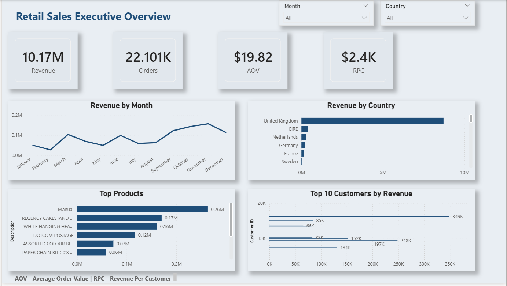
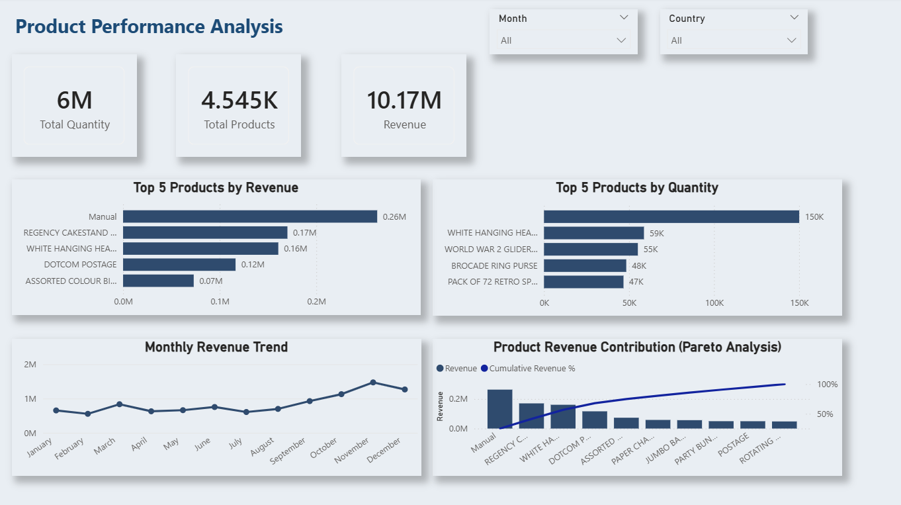
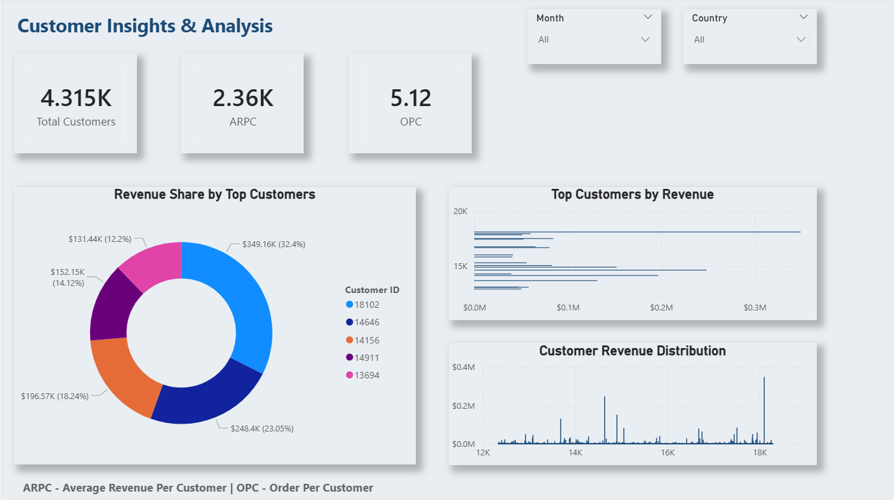

# 📊 Retail Sales Analytics Dashboard

🚀 End-to-end Retail Sales Analytics project using **Python, SQL, and Power BI** to analyze sales trends, customer behavior, and product performance with an interactive dashboard.

---

## 🧠 Project Overview

This project demonstrates a complete **data analytics workflow**:

* 📥 Data Collection (Excel)
* 🧹 Data Cleaning & EDA (Python)
* 🗄️ Data Analysis (SQL)
* 📊 Data Visualization (Power BI)

The goal is to extract meaningful insights and build a business-ready dashboard.

---

## 🏗️ Project Architecture


---

## 📊 Dashboard Preview

### 🔹 Executive Overview



### 🔹 Product Analysis



### 🔹 Customer Analysis



---

## 🗂️ Project Structure

```
retail-sales-analytics-dashboard/
│
├── dashboard_screenshots/   # Dashboard images
├── data/
│   ├── raw/                 # Raw dataset
│   └── processed/           # Cleaned dataset
├── images/                  # Architecture diagram
├── notebooks/               # Python (EDA & Cleaning)
├── powerbi/                 # Power BI dashboard file
├── reports/                 # Business insights
├── sql/                     # SQL queries
├── README.md
```

---

## 🛠️ Tech Stack

* 🐍 Python (Pandas, NumPy, Matplotlib, Seaborn)
* 🗄️ SQL
* 📊 Power BI
* 📁 Excel

---

## 📈 Key Insights

* 📌 Identified top-performing products by revenue
* 📌 Analyzed monthly sales trends
* 📌 Discovered high-value customers
* 📌 Evaluated country-wise revenue distribution

---

## 🚀 How to Use

1. Clone the repository:

```bash
git clone https://github.com/kaushalgaur/retail-sales-analytics-dashboard.git
```

2. Open Jupyter Notebook for data analysis
3. Run SQL queries
4. Open Power BI file to explore dashboard

---

## 📌 Future Improvements

* Add real-time data integration
* Deploy dashboard online
* Automate data pipeline

---

## 🙌 Acknowledgements

This project is built for learning and showcasing **Data Analytics skills**.

---

## ⭐ Support

If you found this project useful, consider giving it a ⭐ on GitHub!
